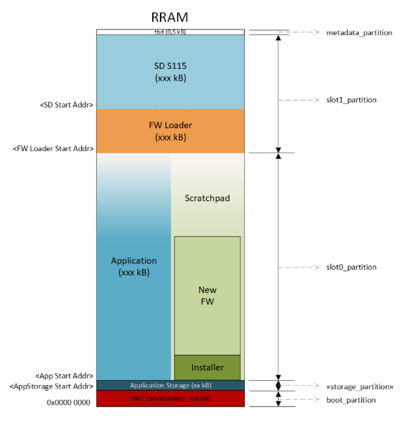
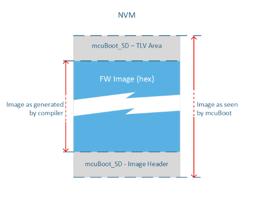
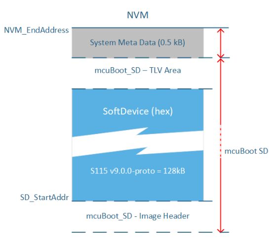

.. _dfu_memory_partitioning:

Memory Partitioning for DFU
###########################

In order to successfully run the DFU process, the memory of the device must be first correctly partitioned to accommodate all required components.

|BMshort| uses Zephyr's `DTS`_ system for memory partitioning.
You can find a practical example of how to partition the memory in chapter :ref:`ug_dfu_preparing_dfu_board`.

Partitions overview
*******************

The following are detailed descriptions of each memory partition needed when running Firmware Over The Air (FOTA) updates with MCUboot as the Initial Root of Trust (IRoT).

The memory in the device is divided into several partitions, each serving a specific function in the DFU process:

.. list-table::
   :header-rows: 1

   * - Partition name
     - Purpose
     - Details
   * - boot_partition
     - Reserved exclusively for IRoT.
     - Starts at address 0x0000, size is determined by the needs of the mcuBoot firmware.
   * - storage_partition (optional)
     - Used for application data storage that persists across resets and firmware updates.
     - Placement and size are configurable based on application requirements.
   * - slot0_partition
     - Contains the main application firmware.
     - Begins immediately after the storage partition or the IRoT partition if the storage is not enabled. The size is maximized up to the start of the firmware loader.
   * - slot1_partition
     - Serves as the location for the DFU mode and contains the firmware loader and the SoftDevice.
     - This partition is split into two to independently validate the images of the firmware loader and the SoftDevice, which is shared with the application.
   * - metadata_partition
     - Utilized by the firmware loader and IRoT for storing metadata.
     - Reserves 0.5 kB at the top of the memory.

Requirements for MCUboot and Arm
********************************

MCUboot requires that each firmware image includes metadata both before and after the firmware hex file.
This metadata is crucial for the validation of the firmware image:

- **Image header**: Placed at the beginning of the firmware image.
- **TLV area**: Positioned after the firmware image to store metadata used for image validation.

.. note:: The size reserved for the image header and TLV area must be consistent across all MCUboot images in a project.

For images that are run as a `main application` that has its own interrupt vector table there is an `Arm requirement`_ on how to place the interrupt vector table in memory.
The table must be placed starting at the 2 kB boundary.
An example of such images are Application and Firmware Loader.
The SoftDevice is not affected by this requirement.

SoftDevice placement
--------------------

The placement of the SoftDevice in memory is predetermined and must align with specific requirements:

- **System Metadata**: Reserves 0.5 kB at the top of the memory.
- **mcuBoot_SD - TLV Area**: Also reserves 0.5 kB.
- **SD_StartAddr**: Must align on a 2 kB memory boundary as specified in the SoftDevice release notes.

The size of the SoftDevice is adjusted based on the minimum requirements set by the SD team, taking into account the above alignment and space reservations.
