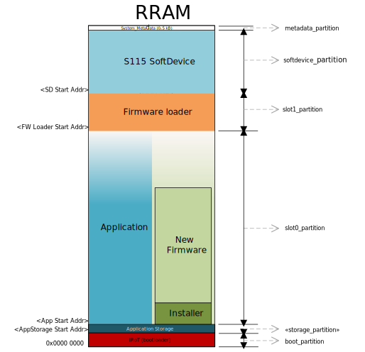
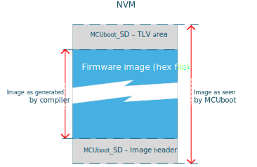
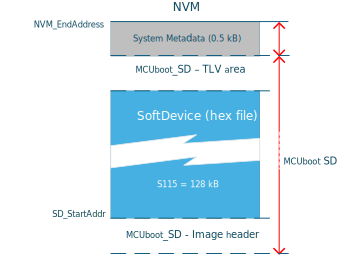

.. _dfu_memory_partitioning:

Memory Partitioning for DFU
###########################

In order to successfully run the DFU process, the memory of the device must be first correctly partitioned to accommodate all required components.

|BMshort| uses Zephyr's `DTS`_ system for memory partitioning.
You can find a practical example of how to partition the memory in chapter :ref:`ug_dfu_preparing_dfu_board`.

Partitions overview
*******************

The following are detailed descriptions of each memory partition needed when running Firmware Over The Air (FOTA) updates with MCUboot as the Initial Root of Trust (IRoT).

The memory in the device is divided into several partitions, each serving a specific function in the DFU process:

.. list-table::
   :header-rows: 1

   * - Partition name
     - Purpose
     - Details
   * - boot_partition
     - Reserved exclusively for IRoT.
     - Starts at address 0x0000, size is determined by the needs of the MCUboot firmware.
   * - slot0_partition
     - Contains the main application firmware.
     - Begins immediately after the storage partition or the IRoT partition if the storage is not enabled.
       The size is maximized up to the start of the firmware loader.
   * - slot1_partition
     - Serves as the location for the DFU mode and contains the firmware loader.
     - This partition contains the firmware loader that is validated by the IRoT.
       The firmware loader is started when entering the DFU mode.
   * - softdevice_partition
     - Used by the SoftDevice.
     - Includes an MCUboot header of size 0x800.
       The SoftDevice is used by both the firmware loader and the application that is running from ``slot0``
   * - metadata_partition
     - Utilized by the firmware loader and IRoT for storing metadata.
     - Reserves 0.5 kB at the top of the memory.
   * - storage_partition (optional)
     - Used for application data storage that persists across resets and firmware updates.
     - Placement and size are configurable based on application requirements.

.. _ug_memorypartiton_irot:

Configuring MCUboot to be IRoT
******************************

Configuring MCUboot to act as Immutable Root of Trust (IRoT) is done using the immutable boot region configuration register ``UICR.BOOTCONF``.
By default, this functionality is disabled, but it can be enabled with the :kconfig:option:`SB_CONFIG_BM_BOOT_BOOTCONF_LOCK_WRITES` sysbuild Kconfig option.
This is done by by creating a :file:`sysbuild.conf` file in the project's root folder and including ``SB_CONFIG_BM_BOOT_BOOTCONF_LOCK_WRITES=y``.

Enabling this option sets the ``EXECUTE``, ``READ``, ``SECURE``, and ``LOCK`` bits in the ``UICR.BOOTCONF`` register and sets the ``UICR.BOOTCONF.SIZE`` to the size of the ``boot_partition`` from the board files.
This enables write protection on the bootloader region and locks down the configuration registers for the immutable boot region.

Programming
===========

With IRoT enabled, you must run an Erase All before programming certain parts of the memory.
In |nRFVSC|, this is done by using the :guilabel:`Erase and Flash to Board` option, or, alternatively, by using  the ``west flash`` command with the ``--erase`` or ``--recover`` arguments.

When IRoT is established, the device is blocked from performing write operations on the ``boot_partition`` without performing an erase all operation.
All other regions are open and can be programmed just like before the IRoT was established.

.. note::
   Use nRF Util device version 2.15.0 or higher as older versions have a known issue related to ERASEALL and UICR.BOOTCONF on nRF54L.
   Alternatively, use the ``Recover`` function to erase the device and remove the IRoT protection.

Requirement for MCUboot
***********************

MCUboot requires that each firmware image includes metadata both before and after the firmware hex file.
This metadata is crucial for the validation of the firmware image:

- **Image header**: Placed at the beginning of the firmware image.
- **TLV area**: Positioned after the firmware image to store metadata used for image validation.

.. note:: The size reserved for the image header and TLV area must be consistent across all MCUboot images in a project.

Vector table alignment
**********************

For images that are run as a `main application` that has its own interrupt vector table there is an `Vector table requirement`_ on how to place the interrupt vector table in memory.
The table must be placed starting at the 2 kB boundary.
An example of such images are application and firmware loader.
The SoftDevice is not affected by this requirement.

SoftDevice placement
********************

The placement of the SoftDevice in memory is predetermined and must align with specific requirements:

- **System Metadata**: Reserves 0.5 kB at the top of the memory.
- **MCUboot_SD - TLV Area**: Also reserves 0.5 kB.
- **SD_StartAddr**: See the SoftDevice release notes for details on size and start address.

The size of the SoftDevice is adjusted taking into account the above alignment and space reservations.

Partition size reference
************************

The table below lists the partition size information for configuration setup with single-bank Device Firmware Update (DFU).
The recommended sizes are based on the configuration used in |BMshort|.

+--------------------------+---------------------+-----------------------+-----------------------+-------------------------+
| Partition name           | Content             | DK board              | Development           | Release                 |
+==========================+=====================+=======================+=======================+=========================+
| ``boot_partition``       | MCUboot             | 31 kB                 | 24 kB                 | 21 kB (using KMU) |br|  |
|                          |                     |                       |                       | 26 kB (without KMU)     |
+--------------------------+---------------------+-----------------------+-----------------------+-------------------------+
| ``storage_partition``    | App data storage    | 8 kB                  | \-                    | \-                      |
+--------------------------+---------------------+-----------------------+-----------------------+-------------------------+
| ``slot0_partition``      | Main application    | \-                    | \-                    | \-                      |
+--------------------------+---------------------+-----------------------+-----------------------+-------------------------+
| ``slot1_partition``      | Firmware loader     | 64 kB                 | 48 kB                 | 32 kB                   |
+--------------------------+---------------------+-----------------------+-----------------------+-------------------------+
| ``softdevice_partition`` | SoftDevice          | \-                    | \-                    | \-                      |
+--------------------------+---------------------+-----------------------+-----------------------+-------------------------+
| ``metadata_partition``   | Stores metadata     | 0.5 kB                | \-                    | \-                      |
+--------------------------+---------------------+-----------------------+-----------------------+-------------------------+

.. note::
   The sizes and configurations of slot0 and slot1 are asymmetrical.

* **DK board** - Represents the partition size that you can find in the board definition files (.dts) that have been defined for the MCUboot board target in |BMshort|.
  These sizes are not optimized but set large enough to provide enough memory to do development on multiple domains without having to adjust the partition size.

* **Development** - Represents the partition size that can be used to maximize the application space (``slot0_partition`` and ``storage_partition``) when running with default configuration of the MCUboot and firmware loader project.
  This setting does not include extra space in the ``slot1_partition`` to accommodate for updates without the risk of having to adjust the partition size.

* **Release** - Represents the partition size recommended when the MCUboot and firmware loader projects are optimized for release.
  See :ref:`dfu_memory_partitioning_optimize` for details.
  The ``boot_partition`` (MCUboot) cannot be updated after the release and the size should be set to match the project.
  The partition size set for ``slot1_partition`` (firmware loader) must contain extra space to accommodate for later updates.

.. _dfu_memory_partitioning_optimize:

Optimizing your project for release
***********************************

Reference sizes of the MCUboot and the firmware loader can be achieved using the default configuration of :ref:`ble_mcuboot_recovery_entry_sample`.

For minimal size, amend the firmware loader configuration using the following Kconfig options:

* Enable :kconfig:option:`CONFIG_LTO`
* Enable :kconfig:option:`CONFIG_ISR_TABLES_LOCAL_DECLARATION`
* Disable :kconfig:option:`CONFIG_LOG`
* Disable :kconfig:option:`CONFIG_CONSOLE`
* Disable :kconfig:option:`CONFIG_BM_UARTE_CONSOLE`
* Disable :kconfig:option:`CONFIG_CRACEN_LIB_KMU`
* Disable :kconfig:option:`CONFIG_PSA_WANT_ALG_CTR_DRBG`
* Disable :kconfig:option:`PSA_USE_CRACEN_MAC_DRIVER`
* Disable :kconfig:option:`PSA_USE_CRACEN_AEAD_DRIVER`
* Disable :kconfig:option:`PSA_USE_CRACEN_CIPHER_DRIVER`

For minimal size, amend the MCUboot configuration using the following Kconfig options:

* Disable :kconfig:option:`CONFIG_LOG`
* Disable :kconfig:option:`CONFIG_CONSOLE`
* Disable :kconfig:option:`CONFIG_BM_UARTE_CONSOLE`

.. note::
   Applying these configurations to the project might cause a few warnings on the log's Kconfig assignments.
   You can ignore these warnings.

If you are not using a DK board target, refer to :ref:`ug_dfu_preparing_dfu_board` for how to partition the memory using the devicetree.
