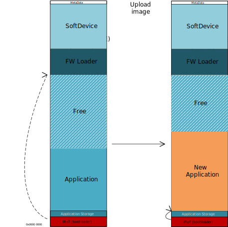
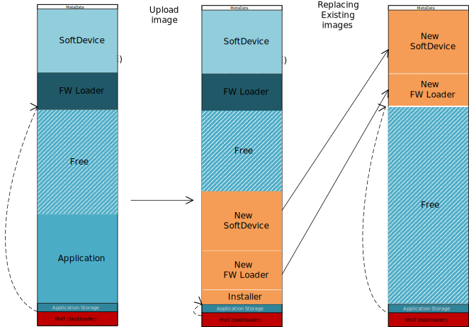

.. _dfu_single_bank:

Single-Bank Device Firmware Update (DFU) Process
################################################

|BMlong| supports a single-bank DFU mechanism.

In the single-bank DFU process, the new firmware image directly overwrites the existing application in the device's memory.
This approach streamlines the update process by directly replacing the existing firmware, optimizing the use of available memory.

Application update
==================

The following are key steps in the single-bank application update.

1. **Inititation**: The DFU bootloader enters DFU mode and initiates the update process.
#. **Firmware Overwriting**: The new firmware image is transferred directly into the location of the existing application.
   This overwriting happens in real-time and replaces the current application.
#. **Validation**: On next reboot, a validation check is performed on the new firmware.
   If the firmware is not valid, the bootloader reverts the device to DFU mode, allowing for another update attempt.
#. **Activation**: Upon successful validation, the new firmware is activated.

SoftDevice and Firmware Loader update
=====================================

The following are the DFU steps when the SoftDevice and/or Firmware Loader are also updated.

1. **Replacement of Existing Application**: The new firmware update process begins with the replacement of the existing application by a new DFU image.
   This image includes an Installer along with updates for the Firmware Loader and/or the SoftDevice.
#. **Validation**: Once the new DFU image is transferred, the system validates both the Installer image and the additional image(s) (Firmware Loader and/or the SoftDevice).
#. **Installation**: After successful validation, the Installer image is activated.
   The Installer carries out the necessary actions to copy the Firmware Loader and SoftDevice to their designated locations in the device's memory.
#. **Device Restart and Final Validation**: Following the installation, the device restarts and performs a final validation of the newly installed Firmware Loader and SoftDevice.
#. **Entry into DFU Mode**: Once the final validation is complete, the device enters DFU mode, ready to receive any further new images.

After a successful update of the SoftDevice and/or Firmware Loader, the application must be updated again following the process described in `Application update`_.
